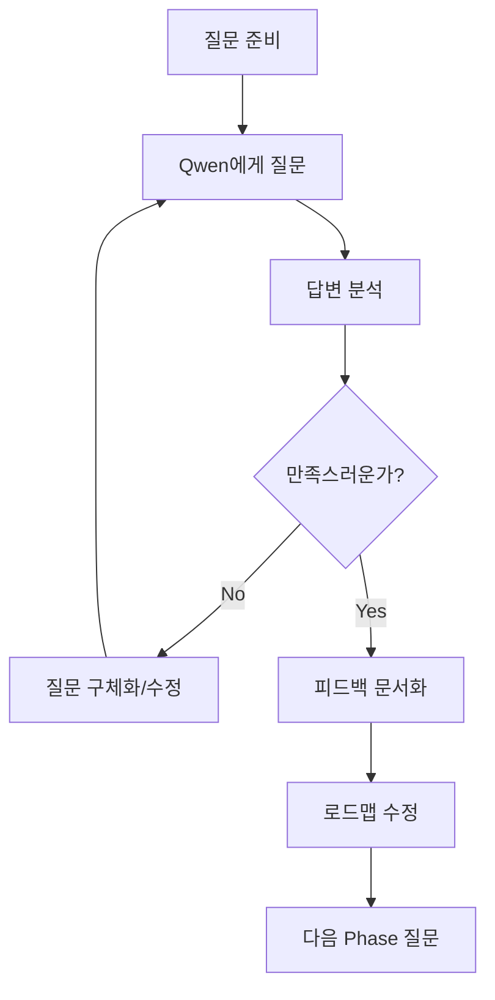

# 🤖 로컬 LLM 피드백 질문 가이드

> **목적**: Ollama AI Agent 훈련 가이드의 실현 가능성(Feasibility) 검증

---

## 📋 질문 1: 전체 로드맵 실현 가능성

### 질문 템플릿:
```
나는 Ollama AI Agent를 개발 중이야. 
현재 Qwen 2.5:7B 모델을 사용하고 있고, 8개의 기본 도구(파일 읽기/쓰기, Git 기본)가 구현되어 있어.

목표는 GenS/Claude Code Agent 수준의 개발자 Assistant를 만드는 거야.

다음 로드맵을 10주에 걸쳐 진행하려고 하는데, 실현 가능한지 평가해줘:

**Phase 1 (2주)**: 파일 도구 확장 (+10개)
- edit_file, multi_edit, glob_search, grep_search, ls_detail
- copy_file, move_file, delete_file, file_info, create_symlink

**Phase 2 (2주)**: 웹 연동 (+8개)
- web_search, web_fetch, http_request, web_crawler
- download_file, image_understand, screenshot, rss_feed

**Phase 3 (3주)**: 지능 강화 (+12개)
- rag_index, rag_search (ChromaDB)
- todo_write, project_backup
- git_push, npm_install, pm2_start, docker_run

**Phase 4 (3주)**: GenS 수준 완성 (+15개)
- 고급 Git, Cloudflare 배포, 코드 품질, 문서 생성, 디버깅

**질문**:
1. 이 로드맵이 10주 안에 실현 가능한가?
2. 각 Phase별로 어떤 어려움이 예상되나?
3. 우선순위를 조정해야 한다면 어떤 걸 먼저 해야 하나?
4. Qwen 2.5:7B 모델의 한계로 인해 불가능한 부분이 있나?
```

### 예상 답변 포인트:
- ✅ 실현 가능 여부
- ⚠️ 잠재적 문제점
- 💡 개선 제안

---

## 📋 질문 2: Agent.ts 구조 검증

### 질문 템플릿:
```
현재 Agent.ts의 구조는 다음과 같아:

1. 사용자 요청 수신
2. LLM(Qwen)에게 "어떤 도구를 써야 하는가?" 프롬프트 전달
3. JSON 응답 파싱 { tool: "read_file", params: ["README.md"] }
4. 해당 도구 실행
5. 결과를 다시 LLM에게 보내서 요약 생성
6. 사용자에게 응답

**문제점**:
- JSON 파싱이 자주 실패함 (Qwen이 일반 텍스트로 답변)
- 복잡한 작업(5단계 이상)을 계획하지 못함
- 에러가 나면 자동 복구를 못함

**질문**:
1. 이 구조가 합리적인가?
2. JSON 파싱 실패를 어떻게 줄일 수 있나?
3. Multi-step 작업을 어떻게 처리해야 하나?
4. LangChain의 ReAct 패턴을 적용하면 개선될까?
```

### 예상 답변 포인트:
- 🔧 구조 개선 방안
- 📝 프롬프트 최적화
- 🔄 에러 처리 전략

---

## 📋 질문 3: RAG 구현 실현 가능성

### 질문 템플릿:
```
Phase 3에서 RAG(문서 기반 답변)를 추가하려고 해.

**계획**:
1. ChromaDB 설치
2. 문서를 500자 청크로 분할
3. Ollama의 nomic-embed-text 모델로 임베딩 생성
4. ChromaDB에 저장
5. 질문이 들어오면 관련 문서 검색 (top-3)
6. 검색된 문서를 컨텍스트로 Qwen에게 답변 요청

**예상 사용 사례**:
- AUTOSAR 가이드 (500페이지 PDF)
- 사내 개발 문서
- API 레퍼런스

**질문**:
1. 이 접근 방식이 합리적인가?
2. 500자 청크 크기가 적절한가?
3. nomic-embed-text vs 다른 임베딩 모델?
4. ChromaDB vs FAISS vs Pinecone?
5. Qwen 7B 모델의 컨텍스트 길이 한계는?
6. 성능 문제(속도/메모리)가 예상되나?
```

### 예상 답변 포인트:
- 📊 청크 크기 권장
- 🔍 임베딩 모델 비교
- 💾 DB 선택 가이드
- ⚡ 성능 최적화

---

## 📋 질문 4: 전공 트랙 실현 가능성

### 질문 템플릿:
```
Agent를 "전공"별로 특화시키려고 해. 대학교 커리큘럼처럼.

**Core Curriculum (공통 - 26개 도구)**
- 모든 Agent가 필수로 배워야 함
- 파일, Git, 웹, RAG 등

**Specialization Tracks (전공)**:

**Track 1: 자동차 SDV Agent**
- AUTOSAR ARXML 파싱
- CAN 메시지 생성
- ECU 코드 자동 생성

**Track 2: 웹 개발 Agent**
- React 컴포넌트 생성
- Hono API 엔드포인트
- Cloudflare 배포

**Track 3: AI 연구 Agent**
- Axolotl 파인튜닝
- DeepSpeed 분산 훈련
- lm-eval 벤치마크

**Track 4: 문서 작성 Agent**
- README 자동 생성
- Mermaid 다이어그램
- API 문서화

**질문**:
1. 하나의 Agent 코드베이스에서 여러 "전공"을 선택적으로 로드하는 게 가능한가?
2. 전공별로 별도 Agent를 만들어야 하나?
3. 설정 파일(specialization.json)로 도구를 동적 로드하는 게 현실적인가?
4. 전공마다 다른 프롬프트 스타일이 필요한가?
```

### 예상 답변 포인트:
- 🏗️ 아키텍처 설계
- 📦 모듈화 전략
- ⚙️ 설정 관리

---

## 📋 질문 5: 도구 개수 vs 성능

### 질문 템플릿:
```
현재: 8개 도구
목표: 45+개 도구

**우려사항**:
1. 도구가 45개가 되면 프롬프트가 너무 길어지지 않나?
   (모든 도구 설명을 프롬프트에 포함해야 함)

2. Qwen이 45개 중에서 올바른 도구를 선택할 수 있나?

3. 컨텍스트 길이 제한은?
   - Qwen 2.5:7B의 최대 컨텍스트: 32k 토큰
   - 도구 45개 설명: ~5000 토큰 (예상)
   - 대화 히스토리: ~10000 토큰
   - 남은 여유: ~17000 토큰

**질문**:
1. 45개 도구가 현실적인 목표인가?
2. 도구를 카테고리별로 묶어서 2단계로 선택하는 게 나을까?
   예: "파일 작업" → "edit_file"
3. 자주 쓰는 도구만 프롬프트에 포함하고, 나머지는 필요 시 로드?
4. 도구 임베딩을 만들어서 시맨틱 검색으로 선택?
```

### 예상 답변 포인트:
- 📏 최적 도구 개수
- 🎯 선택 전략
- 🧠 컨텍스트 관리

---

## 📋 질문 6: 비용 vs 성능 트레이드오프

### 질문 템플릭:
```
**현재 환경**:
- 로컬 PC: Ryzen AI 9 HX 370, 128GB RAM
- 모델: Qwen 2.5:7B (4.7GB)
- 비용: $0 (완전 로컬)

**대안**:
1. 더 큰 모델 사용?
   - Qwen 2.5:14B (8GB)
   - Qwen 2.5:32B (20GB)
   - 또는 CodeQwen 전용 모델?

2. 클라우드 API 병행?
   - 복잡한 작업만 GPT-4/Claude API 사용
   - 나머지는 로컬 Qwen

**질문**:
1. Qwen 7B로 45개 도구를 다루기엔 역부족인가?
2. 14B나 32B로 업그레이드하면 체감 차이가 클까?
3. 하이브리드 접근(로컬 + 클라우드)이 현실적인가?
4. 128GB RAM에서 어떤 모델까지 실행 가능한가?
```

### 예상 답변 포인트:
- 💻 하드웨어 최적화
- 📊 모델 크기 vs 성능
- 💰 비용 효율성

---

## 📋 질문 7: AI Research Skills 통합

### 질문 템플릿:
```
Orchestra Research의 "AI Research Skills" 80+개 라이브러리를 발견했어.

**카테고리**:
- Model Architecture (5) - LitGPT, Mamba, NanoGPT
- Fine-Tuning (4) - Axolotl, LLaMA-Factory, PEFT
- Post-Training (8) - TRL, GRPO, OpenRLHF
- Distributed Training (6) - Megatron, DeepSpeed, FSDP
- Agents (4) - LangChain, LlamaIndex, CrewAI
- RAG (5) - Chroma, FAISS, Pinecone
- [총 80+개...]

**내 분석**:
- 10%만 직접 적용 가능 (Agents, RAG)
- 70%는 LLM 훈련/배포 전문 (우리와 무관)
- 20%는 개념만 참고

**가져오려는 것**:
1. LangChain (Agent 패턴) ← 즉시
2. Chroma (RAG) ← Phase 3
3. DSPy (Prompt Engineering) ← 개념만

**질문**:
1. 이 판단이 합리적인가?
2. 놓친 유용한 스킬이 있나?
3. LangChain 패턴을 TypeScript로 포팅할 때 주의점은?
4. 외부 라이브러리 vs 직접 구현 어느 게 나을까?
```

### 예상 답변 포인트:
- ✅ 통합 우선순위
- 🔄 포팅 전략
- 📚 학습 경로

---

## 🎯 **3. 질문 실행 방법**

### **방법 1: Ollama CLI로 직접 질문** (추천!)

```bash
# Windows PowerShell 또는 터미널

# 1. 질문 파일 준비
$question = @"
[위 질문 템플릿 복사]
"@

# 2. Ollama에게 질문
ollama run qwen2.5:7b "$question"

# 또는 파일로 저장 후
echo $question > question.txt
ollama run qwen2.5:7b < question.txt
```

### **방법 2: Ollama AI Agent 통해 질문**

```bash
# ollama-ai-agent 실행
cd C:\A-SDV-Platform\ollama-ai-agent
npm run dev

# Agent에게 질문
You: 내가 만든 훈련 로드맵을 평가해줘. 
     Phase 1: 파일 도구 10개 추가 (2주)
     Phase 2: 웹 연동 8개 추가 (2주)
     ...
     실현 가능한가?
```

### **방법 3: 문서 파일을 통째로 분석** (가장 효과적!)

```bash
# 1. 문서 읽어서 질문
ollama run qwen2.5:7b "
다음 문서를 읽고 실현 가능성을 평가해줘:

$(cat C:\A-SDV-Platform\automotive-sdv-platform\OLLAMA_TO_CLAUDE_ROADMAP.md)

평가 기준:
1. 기술적 실현 가능성
2. 시간 할당의 합리성
3. 도구 개수의 적절성
4. Qwen 7B 모델의 한계
5. 개선 제안
"
```

---

## 📊 **4. 피드백 정리 템플릿**

### 답변을 받은 후 정리:

```markdown
# 🤖 Qwen 2.5:7B 피드백 보고서

**질문 날짜**: 2026-02-02
**모델**: Qwen 2.5:7B
**질문 주제**: [Phase 1 실현 가능성 / RAG 구현 / 등]

## 📋 질문 요약
[질문 내용 요약]

## 💬 LLM 답변 (원문)
```
[Qwen의 답변 전체 복사]
```

## ✅ 주요 피드백
1. **실현 가능**: [예/아니오/조건부]
2. **예상 문제점**: 
   - 문제 1
   - 문제 2
3. **개선 제안**:
   - 제안 1
   - 제안 2

## 🎯 액션 아이템
- [ ] 제안 1 적용
- [ ] 제안 2 검토
- [ ] 추가 질문 필요

## 📝 메모
[추가 생각, 의문점 등]
```

---

## 💡 **5. 효과적인 질문 팁**

### ✅ DO (좋은 질문):
```
1. 구체적인 숫자와 기한 제시
   ❌ "빨리 할 수 있을까?"
   ✅ "10주 안에 45개 도구를 추가할 수 있을까?"

2. 현재 상황 명시
   ❌ "RAG를 추가하려고 해"
   ✅ "현재 8개 도구가 있고, Qwen 7B를 사용 중이야. 
       Phase 3에서 ChromaDB RAG를 추가하려고 해."

3. 제약 조건 명시
   ❌ "이게 가능한가?"
   ✅ "Ryzen AI 9 HX 370, 128GB RAM 환경에서
       Qwen 7B로 45개 도구를 다룰 수 있나?"

4. 여러 선택지 제시
   ❌ "어떻게 해야 하나?"
   ✅ "A) ChromaDB vs B) FAISS 중 어느 게 나을까?"
```

### ❌ DON'T (피해야 할 질문):
```
1. 너무 추상적
   ❌ "Agent를 잘 만들려면?"

2. 정보 부족
   ❌ "RAG가 가능한가?" (무슨 RAG? 어떤 환경?)

3. 너무 광범위
   ❌ "AI Agent의 모든 것을 알려줘"
```

---

## 🔄 **6. 반복 피드백 프로세스**



---

## 📌 **7. 실전 예시**

### 예시 1: Phase 1 검증

**질문**:
```bash
ollama run qwen2.5:7b "
나는 Ollama AI Agent를 개발 중이야.
현재 Qwen 2.5:7B, 8개 기본 도구(read_file, write_file, git_status 등).

Phase 1에서 2주 동안 10개 도구를 추가하려고 해:
- edit_file (파일 수정)
- multi_edit (여러 곳 동시 수정)
- glob_search (패턴 검색)
- grep_search (내용 검색)
- ls_detail (상세 목록)
- copy/move/delete_file
- file_info, create_symlink

각 도구당 평균 200줄 코드 예상.

질문:
1. 2주 안에 10개 도구 구현이 현실적인가?
2. 우선순위는? 어떤 걸 먼저?
3. 가장 어려운 도구는?
4. Qwen 7B가 10개 추가 도구를 잘 구분할 수 있나?
"
```

**예상 답변 활용**:
→ Qwen이 "edit_file을 먼저 하라"고 하면 → 그대로 시작!
→ Qwen이 "2주는 빡빡하다"고 하면 → 3주로 조정!

---

이제 당신이 할 일:

1. ✅ **위 질문 중 하나 선택** (추천: 질문 1 - 전체 로드맵)
2. ✅ **Ollama에게 질문**
3. ✅ **답변을 나에게 공유**
4. ✅ **함께 분석 후 로드맵 수정**

어떤 질문부터 시작할까요? 🚀
